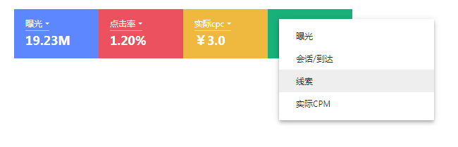

## ColourBlock

* Created By ancf - (博客地址)[https://kafeihaoka.github.io/myBlog.html#/welcome]

* ColourBlock 为一款基于react由4个彩色块组成的多维度选择器，一般与图表搭配结合使用，通过控制彩色块的选择
动态改变图表的数据展现形式。



DEMO示例地址：https://kafeihaoka.github.io/react-colour-block/

## 安装依赖
npm i react-colour-block -S

## API 介绍

| Property | Description | Type | Default |
| --- | --- | --- | --- |
| data | 设置组件数据 | array | - |
| onShow | 点击彩色块的操作,返回最新的data数据，注意将返回的数据设置为最新的data数据 | function(e){} | - |
| onChange | 点击彩色块里的下拉框维度选择的操作,返回最新的data数据，注意将返回的数据设置为最新的data数据 | function(e){} | - |
| onMouseEnter | 移入彩色块的操作,返回移入的彩色块索引 | function(e){} | - |
| onMouseLeave | 移出彩色块的操作,返回移出的彩色块索引 | function(e){} | - |

> 彩色块数据

    data: [],  注入组件数据
    
    data数据模型 ==>
    
            [{
                     value:{
                         label:'',
                         value:0
                     },//彩色块里下拉框所选择的value值
                     options:[{
                         label:'',
                         value:0
                     },{},....],//彩色块里下拉框options值
                     isShow:true,//为true彩色块背景色为彩色，false默认白色
                     disabled:false,//为true代表彩色块的下拉框可点击，false不可点击
                     total:''//彩色块里的标题文字部分
              },
              {
                  ...同上
              },
               {
                  ...同上
               },
               {
                  ...同上
               }
            ]
    
> function 展示

    onShow: ()=> {},  返回最新的data数据已更改data里的相应的isShow的值，注意在此方法里将返回的data数据设置为最新的data数据；
    
> function 选择

    onChange: ()=> {},  返回最新的data数据已更改data里的相应的value的值，注意在此方法里将返回的data数据设置为最新的data数据；
    
> function 鼠标移入事件

    onMouseEnter: (e)=> {}, 鼠标移入任一彩色块时触发，返回彩色块索引

> function 鼠标移出事件

    onMouseLeave: ()=> {}, 鼠标移出任一彩色块时触发，返回彩色块索引

## 用法示例

```

import ColourBlock from "react-colour-block";

class ColourBlockDemo extends React.Component {
      state = {
        data :[
             {
                  "value": {
                      "label": "点击",
                      "value": "1"
                  },
                  "options": [
                      {
                          "label": "点击",
                          "value": "1"
                      },
                      {
                          "label": "曝光",
                          "value": "2"
                      },
                      {
                          "label": "留存",
                          "value": "3"
                      }
                  ],
                  "isShow": true,
                  "disabled": false,
                  "total": "19.23M"
              },
              {
                  "value": {
                      "label": "点击率",
                      "value": "1"
                  },
                  "options": [
                      {
                          "label": "点击率",
                          "value": "1"
                      },
                      {
                          "label": "曝光率",
                          "value": "2"
                      },
                      {
                          "label": "留存率",
                          "value": "3"
                      }
                  ],
                  "isShow": true,
                  "disabled": false,
                  "total": "1.20%"
              },
              {
                  "value": {
                      "label": "实际cpc",
                      "value": "1"
                  },
                  "options": [
                      {
                          "label": "实际cpc",
                          "value": "1"
                      },
                      {
                          "label": "实际cpl",
                          "value": "2"
                      },
                      {
                          "label": "到达率",
                          "value": "3"
                      }
                  ],
                  "isShow": false,
                  "disabled": true,
                  "total": "￥3.0"
              },
              {
                  "value": {
                      "label": "线索",
                      "value": "1"
                  },
                  "options": [
                      {
                          "label": "曝光",
                          "value": "2"
                      },
                      {
                          "label": "会话/到达",
                          "value": "3"
                      },
                      {
                          "label": "线索",
                          "value": "4"
                      },
                      {
                          "label": "实际CPM",
                          "value": "5"
                      }
                  ],
                  "isShow": false,
                  "disabled": true,
                  "total": "￥68.84M"
              }
          ]
      };

      handleShow = (e) => {
          // console.log(e)
          this.setState({
              data:e
          })
      }
  
      handleChange = (e) => {
          console.log(e)
          this.setState({
              data:e
          })
      }
  
      handleMouseEnter = (e) => {
          // console.log(e)
      }
  
      handleMouseLeave = (e) => {
          // console.log(e)
      }

  render() {
    const { data } = this.state;
    return (
      <div>
        <ColourBlock
           data={data}
           onShow={this.handleShow}
           onChange={this.handleChange}
           onMouseEnter={this.handleMouseEnter}
           onMouseLeave={this.handleMouseLeave}
        />
      </div>
    );
  }
}

ReactDOM.render(<ColourBlockDemo />, mountNode);

```